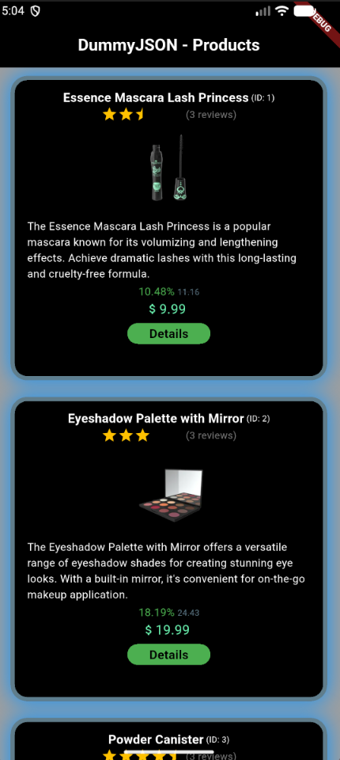
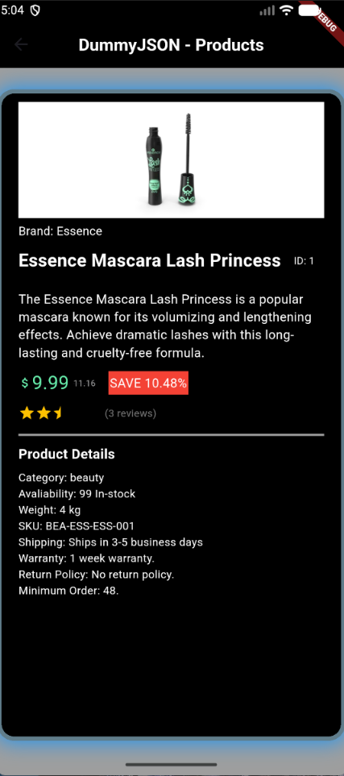
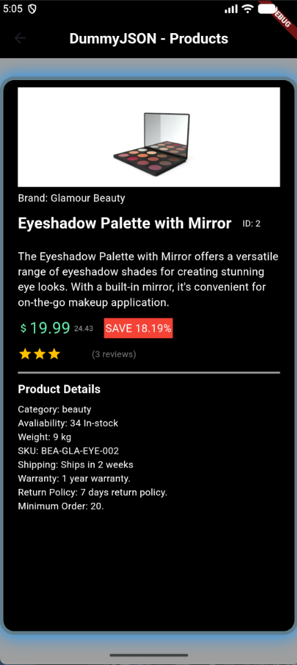

# DummyJSON API (Homework 6)

### Content:

**Product List:** View all products on the home screen.
 
**Product Details:** Tap a product to see more info like stock, shipping, and category.
 
**Price before/after discount:** Displays discounts and original prices.

### Pictures:

*Homepage (Product List):*

 

*Essence Mascara Details Page:*

 

*Eye Shaddow Palette Details Page:*

